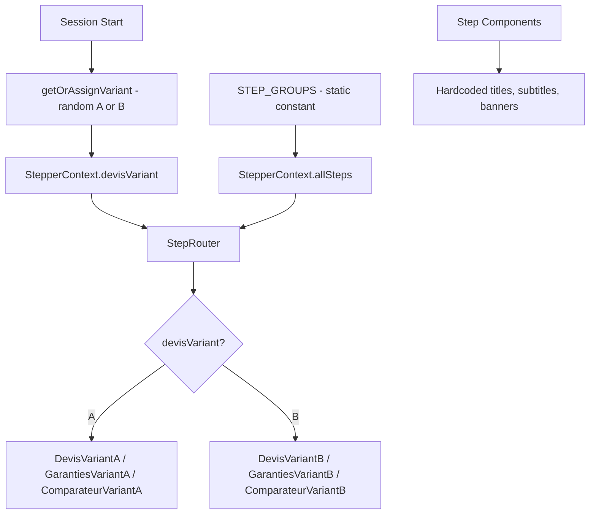
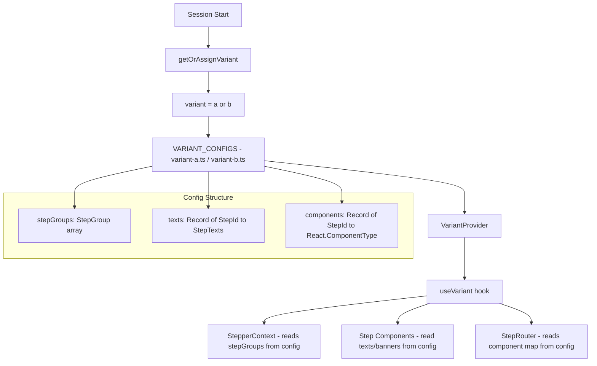
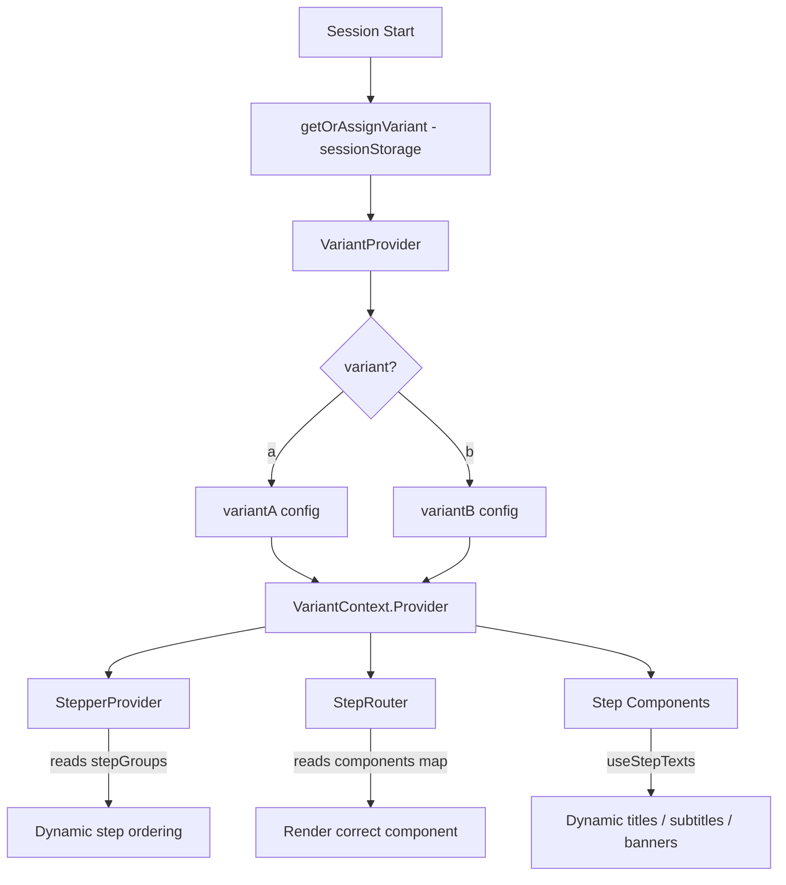

# Unified Variant System — Architecture Plan

## Problem Statement

The current codebase has a **page-level variant system** (`devisVariant: "a" | "b"`) that only controls which React component renders for devis-related steps. However, the following are **hardcoded** across 20+ step components:

- **Titles, subtitles, option labels, button text** — inline JSX strings
- **AlertBanner presence and content** — some steps show banners, others don't; the text is hardcoded
- **Step order and step groups** — `STEP_GROUPS` is a static constant in `StepperContext.tsx`

We need a **single unified variant** (the existing A/B assignment) to control **all** of these dimensions: page layout, displayed texts, alert banners, and step flow ordering.

---

## Current Architecture (What Exists)



**Problems:**

1. Texts are scattered across ~20 component files as inline strings
2. Adding a variant B text means duplicating entire components or adding conditionals everywhere
3. Step order is a static constant — no way to vary it per variant
4. AlertBanner content and visibility is hardcoded per step component

---

## Proposed Architecture

### Core Idea: Variant Configuration Objects

Instead of scattering variant logic across components, define **one configuration object per variant** that declares everything: texts, banners, step order. Components become **generic renderers** that read from the active config.



### File Structure

```
config/
  variants/
    types.ts              # Shared types for variant configs
    variant-a.ts          # Full config for variant A
    variant-b.ts          # Full config for variant B
    index.ts              # Resolver: picks config based on variant key
context/
  VariantContext.tsx       # New context providing the active variant config
  StepperContext.tsx       # Modified: reads step groups from VariantContext
```

### 1. Variant Config Type Definition (`config/variants/types.ts`)

```typescript
import type { ReactNode, ComponentType } from "react";
import type { StepId, StepGroup } from "@/context/StepperContext";

/** Text content for a single step screen */
export interface StepTexts {
  title: ReactNode;
  subtitle?: ReactNode; // Can be a function receiving form data for dynamic subtitles
  banner?: {
    variant: "info" | "default" | "warning";
    title: ReactNode;
    subtitle?: ReactNode;
    icon?: "info" | "image"; // Simplified icon selection
    imageSrc?: string;
  };
  options?: Array<{ value: string; label: string }>;
  ctaLabel?: string; // Override "Suivant" button text
}

/** Full variant configuration */
export interface VariantConfig {
  id: "a" | "b";

  /** Step groups and ordering — controls the entire flow */
  stepGroups: StepGroup[];

  /** Per-step text overrides */
  texts: Partial<Record<StepId, StepTexts>>;

  /** Per-step component overrides — only needed for steps with different layouts */
  components?: Partial<Record<StepId, ComponentType>>;
}
```

### 2. Variant Config Files

**`config/variants/variant-a.ts`** — contains the current hardcoded values extracted into a config:

```typescript
export const variantA: VariantConfig = {
  id: "a",
  stepGroups: [
    {
      id: 1,
      label: "Onboarding",
      steps: [{ id: "onboarding", label: "Onboarding" }],
    },
    {
      id: 2,
      label: "Situation",
      steps: [
        { id: "profil", label: "Profil" },
        { id: "personalInfo", label: "Informations personnelles" },
        // ... current order
      ],
    },
    // ... all current groups
  ],
  texts: {
    profil: {
      title: "Votre situation pro ?",
      options: [
        { value: "salarie", label: "Salarié(e)" },
        { value: "independant_tns", label: "Indépendant(e) /TNS" },
        // ...
      ],
    },
    sante_yeux: {
      title: "On commence par vos yeux ?",
      banner: {
        variant: "info",
        title: "On vous répond comme vous préférez.",
        subtitle: "Un conseiller reprend votre demande...",
        icon: "info",
      },
    },
    // ... all steps
  },
  components: {
    devis_placeholder: DevisVariantA,
    garanties: GarantiesVariantA,
    offre_comparateur: ComparateurVariantA,
  },
};
```

**`config/variants/variant-b.ts`** — can override any subset:

```typescript
export const variantB: VariantConfig = {
  id: "b",
  stepGroups: [
    // Different step order — e.g., santé before situation, or extra/fewer steps
    {
      id: 1,
      label: "Onboarding",
      steps: [{ id: "onboarding", label: "Onboarding" }],
    },
    {
      id: 2,
      label: "Situation",
      steps: [
        { id: "profil", label: "Profil" },
        // Reordered or different steps
      ],
    },
    // ...
  ],
  texts: {
    profil: {
      title: "Quel est votre statut professionnel ?", // Different wording
      // No banner for this step in variant B
    },
    sante_yeux: {
      title: "Parlons de vos yeux",
      banner: {
        variant: "info",
        title: "Nostrum Care rembourse plus de 40 médecines douces", // Different banner text
        subtitle: "ostéopathie, sophrologie, psychologie...",
        icon: "info",
      },
    },
    phoneNumber: {
      title: "Et pour vous contacter ?",
      banner: undefined, // Explicitly no banner in variant B
    },
  },
  components: {
    devis_placeholder: DevisVariantB,
    garanties: GarantiesVariantB,
    offre_comparateur: ComparateurVariantB,
  },
};
```

### 3. VariantContext (`context/VariantContext.tsx`)

```typescript
const VariantContext = createContext<VariantConfig>(variantA);

export function VariantProvider({ children }: { children: ReactNode }) {
  const [config] = useState(() => {
    const variant = getOrAssignVariant(); // Reuse existing function
    return variant === "b" ? variantB : variantA;
  });

  return (
    <VariantContext.Provider value={config}>
      {children}
    </VariantContext.Provider>
  );
}

export function useVariant() {
  return useContext(VariantContext);
}

/** Convenience hook: get texts for a specific step */
export function useStepTexts(stepId: StepId): StepTexts | undefined {
  const { texts } = useVariant();
  return texts[stepId];
}
```

### 4. Modified StepperContext

The `StepperContext` no longer owns `STEP_GROUPS` as a static constant. Instead, it reads from `VariantContext`:

```typescript
export function StepperProvider({ children }: StepperProviderProps) {
  const { stepGroups } = useVariant(); // <-- Dynamic step groups from variant config
  const allSteps = useMemo(
    () => stepGroups.flatMap((g) => g.steps),
    [stepGroups],
  );
  // ... rest unchanged
}
```

### 5. Modified Step Components

Step components become **thinner** — they read texts from the variant config instead of hardcoding them:

```typescript
// Before (current)
export function ProfilStep() {
  return (
    <StepScreen title="Votre situation pro ?" ...>
      {OPTIONS.map(opt => <Button ...>{opt.label}</Button>)}
    </StepScreen>
  );
}

// After (proposed)
export function ProfilStep() {
  const texts = useStepTexts("profil");
  const options = texts?.options ?? DEFAULT_PROFIL_OPTIONS;

  return (
    <StepScreen title={texts?.title ?? "Votre situation pro ?"} ...>
      {options.map(opt => <Button ...>{opt.label}</Button>)}
      {texts?.banner && <AlertBanner {...texts.banner} />}
    </StepScreen>
  );
}
```

### 6. Modified StepRouter

```typescript
export function StepRouter() {
  const { currentStepDef } = useStepper();
  const { components } = useVariant();

  // Variant-specific component override, or fall back to default map
  const Component = components?.[currentStepDef.id] ?? DEFAULT_STEP_COMPONENTS[currentStepDef.id];

  return <Component />;
}
```

---

## Architecture Diagram — Full Flow



---

## What Each Variant Controls

| Dimension                            | How It Is Configured                         | Where It Is Consumed                                   |
| ------------------------------------ | -------------------------------------------- | ------------------------------------------------------ |
| **Step order and groups**            | `variantConfig.stepGroups`                   | `StepperContext` reads from `VariantContext`           |
| **Page titles and subtitles**        | `variantConfig.texts[stepId].title/subtitle` | Step components via `useStepTexts` hook                |
| **AlertBanner presence and content** | `variantConfig.texts[stepId].banner`         | Step components — render banner only if config has one |
| **Option labels**                    | `variantConfig.texts[stepId].options`        | Step components with selection buttons                 |
| **CTA button text**                  | `variantConfig.texts[stepId].ctaLabel`       | `StepScreen` component                                 |
| **Page layout/component**            | `variantConfig.components[stepId]`           | `StepRouter` — picks variant-specific component        |

---

## Migration Strategy

The migration can be done incrementally — no big-bang rewrite needed:

1. **Create the config structure and VariantContext** — wire it up with the existing `getOrAssignVariant`
2. **Extract current hardcoded values into `variant-a.ts`** — this is the baseline; the app behaves identically
3. **Modify `StepperContext`** to read `stepGroups` from `VariantContext` instead of the static `STEP_GROUPS`
4. **Modify `StepRouter`** to check `components` map from variant config
5. **Incrementally update step components** — one at a time, replace hardcoded strings with `useStepTexts` lookups
6. **Create `variant-b.ts`** with the desired differences (different texts, banners, step order)
7. **Remove the old `devisVariant` field** from `StepperContext` (it is now subsumed by `VariantContext`)

---

## Why This Is the Cleanest Approach

1. **Single source of truth per variant** — all differences between A and B are visible in one file, not scattered across 20+ components
2. **Type-safe** — TypeScript enforces that every variant config has the right shape
3. **Incremental** — components can adopt `useStepTexts` one at a time; fallback defaults keep everything working
4. **No component duplication** — unlike the current approach of `variant-a.tsx` / `variant-b.tsx` full component copies, most steps share the same component and just read different text
5. **Easy to add variant C** — just create `variant-c.ts` and update the resolver
6. **Testable** — variant configs are plain objects, easy to snapshot-test or validate
7. **Step order flexibility** — variant B can reorder, add, or remove steps without touching any component code
